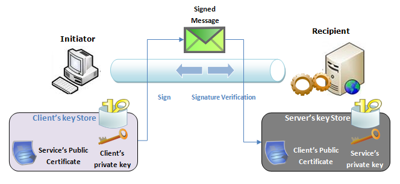
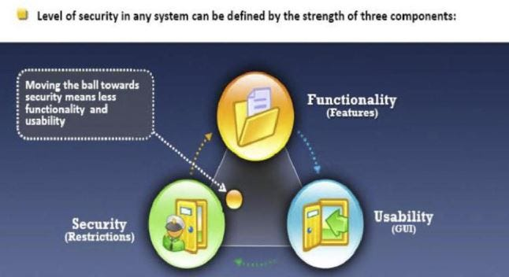

# Information security overview

## Seguridad de información

- Proteger la información y los sistemas de información.
- Define conjuntos de procesos y actividades realizadas con el fin de proteger la información.
- El objetivo es evitar que usuarios no autorizados roben y hagan un mal uso de información o servicios.
 - Si la información confidencial cae en manos equivocadas, puede causar enormes pérdidas, incluidas
 - finanzas, reputación de marca, clientes.

## Términos Esenciales

### Hack value

- Evaluación de los hackers sobre si algo vale o es interesante.
- Ejemplos de alto valor de Hack
 - Acceder a la información de la tarjeta de crédito de las personas, ya que puede generar dinero.
 - Es posible acceder simplemente a los nombres de las personas para mostrar una tarea difícil.

### Vulnerability

- Debilidad que puede comprometer el sistema y ser utilizada para un posible ataque.
	 - una politica
		 - política que regula si un personal debe conectar unidades USB a computadoras portátiles.
 - Errores de diseño/implementación
	 - Linux + macOS + Windows son susceptibles a una vulnerabilidad en la que una unidad USB se disfraza de teclado y tiene mayor acceso a la computadora

### Exploit

- Incumplimiento de vulnerabilidades.
- También se refiere a un software que permite aprovechar vulnerabilidades identificadas.
	- conectando un USB malicioso.

### Payload

- Parte de [malware](../07-malware/malware-overview.md) o código de explotación.
	- Utilizado para:
		 - Crear [puerta trasera](./../07-malware/malware-overview.md#backdoor) en la máquina de la víctima
		 - Dañar o eliminar archivos
		 - Confirmar datos
		 - Secuestro de un ordenador
			- un keylogger o una RAT (Herramienta de administración remota) que instala un USB malicioso.

### Zero day attack

- También conocido como • ***ataque de día cero*** • ***ataque de 0 días***
- Explotar vulnerabilidades previamente desconocidas antes de que se lance el parche.

**Vulnerabilidad de día cero**
	- Agujero en el software
		 - Desconocido para el que está interesado en mitigar (por ejemplo, el proveedor)
		 - Conocido pero el parche no ha sido desarrollado.
	 - Los ataques dirigidos suelen incluir vulnerabilidades de día cero
	 ❗ Una vulnerabilidad no es de día cero una vez que se divulga y se parchea

**Zero-Day exploit**
	 - Aprovechar las vulnerabilidades de día cero
	 - A menudo se realiza mediante el uso de malware

**Flow**
 1. El atacante descubre la vulnerabilidad.
 2. El atacante aprovecha la vulnerabilidad
 3. Ocurre el ataque (llamado día cero)
 4. El proveedor aprende sobre la vulnerabilidad
 5. Se crea el parche
	 - A veces, es posible que el proveedor no lo parchee, p. si el software está desactualizado o no tiene soporte.
 6. Se aplica el parche
	 ❗ ¡A veces no lo son!
		 - Los enrutadores domésticos tienen vulnerabilidades que se conocen desde hace años, ya que los ISP no suelen configurar los enrutadores después de la instalación.
		 - 💡 Los hackers aprovechan al máximo el período de tiempo entre la creación y la aplicación del parche.
		 - Muchas veces las corporaciones tardan en reaccionar, lo que causa daño.

**Ventana de vulnerabilidad (WOV)**
	 - Tiempo desde que se descubre la vulnerabilidad hasta que se parchean los sistemas más vulnerables
	 - A menudo se mide en días, ejemplo 28 días.
	
Ejemplo **[Espectro](./../06-system-hacking/escalating-privileges.md#spectre-vulnerability) & [Meltdown](./../06-system-hacking/escalating-privileges.md#meltdown-vulnerability )**
	 - Vulnerabilidades en CPU AMD e Intel
	 - Puede explotarse para elevar los privilegios en el sistema determinado.
	 - Todavía existe pero ya no es un día cero.
	 - Afectó a todos los proveedores de nube, necesitaban ejecutar actualizaciones de firmware, actualizaciones proporcionadas por Intel que causaron retrasos.
### Daisy chaining
- Un ataque en el que los hackers obtienen acceso a una red/dispositivo y luego lo utilizan para acceder a las siguientes redes/dispositivos.
- **Pasos**
	 1. Los Hackers obtienen acceso a un dispositivo dentro de su sistema/red
		 - ejemplo: reloj inteligente, frigorífico, PC.
	2. Avanzan más al obtener acceso al siguiente dispositivo de su red y luego al siguiente y así sucesivamente.
		 - Al final, el hacker potencialmente es dueño de la red.
🤗 **Ejemplo para hackear bancos o similar**
	 1. Vaya tras la persona que tenga más acceso.
	 2. Hackear el enrutador doméstico de esa persona como vector de ataque.
		 - Porque tiene la menor resistencia en comparación con la red corporativa.
			 - Red corporativa: tiene firewalls corporativos, material de TI, políticas, etc.
			 - Router doméstico: Rara vez actualizado, lleno de vulnerabilidades.
			 - Suelen ejecutar un sistema operativo Linux de tamaño reducido.
		 - Un **vector de ataque** es un método o vía utilizado por un pirata informático para acceder o penetrar en el sistema objetivo.
	 3. Escanee los dispositivos que están conectados al enrutador.
		 - Puede ver la comunicación (se puede cifrar), pero siempre ve los puertos, URL y direcciones que se utilizan.
		 - Ejemplo: PC del hombre, PC de la esposa, TV inteligente/refrigerador, teléfono celular de su esposa, etc.
	 4. Ataque con diferentes opciones de vectores de ataque:
		 - Cambie la configuración de DNS, puede configurarse como DNS.
		 - Coloque su computadora en DMZ para exponer su PC al acceso desde el mundo exterior.
		 - Aplicar phishing, exploits al sistema operativo de los dispositivos.
		 - Obtener acceso a uno de los sistemas.
			 - Ejemplo: un teléfono Android. Tienen muchas vulnerabilidades.
			 - No reciben actualizaciones después de un tiempo.
			 - Si exceden los límites de diseño, Ejemplo: cuando se opera cuando hace calor afuera, las fallas de hardware que ocurren causan ataques de software explotables como [Bitsquatting](https://en.wikipedia.org/wiki/Bitsquatting)
	 5. Obtenga acceso a
		 - Información como cuentas bancarias, datos de tarjetas de crédito.
		 - Después de infectar un dispositivo, salte otros dispositivos en la red del banco si, por ejemplo, El teléfono móvil también se utiliza en la red bancaria.

### Doxing
- Encontrar y publicar información de identificación personal (PII) de alguien por motivos maliciosos.
- Ejemplo: el nombre de una persona, una dirección de correo electrónico o datos sensibles de una organización.
- Ejemplo: Los archivos gubernamentales confidenciales se filtran al público.
- Pasos
	 1. Recopilar información privada y valiosa sobre una persona/organización.
		 - Ejemplo: fotografías, SSN, cuentas sociales, dirección...
		 - Cree un perfil de destino obteniendo más información, Ejemplo: a través de las redes sociales.
	 2. Mal uso de la información recopilada por diferentes motivos.
		 - Ejemplo: robo de identidad, robo de información financiera para su uso, obligar a sus objetivos a hacer algo que no quieren

### Bot
- Uso de un "robot"
- Un software que se puede controlar para ejecutar tareas predefinidas.
- Utilizado por Hackers para controlar las máquinas infectadas por motivos maliciosos.
- Caso de uso
	 - Ejemplo: usar un bot para controlar la computadora y realizar ataques a otras computadoras
	 - Ejemplo: creando una botnet infectando más máquinas

## CIA triad

- También conocido como ***tres principios de seguridad de la información***
- Reconocido ampliamente como el centro (enfoque principal) de la seguridad de la información.

   

- Deben funcionar como metas y objetivos para cada programa de seguridad.
- 📝 Asegura
 - [Confidencialidad](#confidencialidad): para que nadie pueda ver lo que hay dentro.
 - [Integridad](#integridad): nadie manipula los datos en tránsito
 - [Disponibilidad](#disponibilidad): se puede acceder a los datos bajo demanda

## Elements of information security

### Confidencialidad

- Garantiza que la información esté disponible sólo para las personas que estén autorizadas a acceder a ella.
- Un tratamiento inadecuado de los datos o un intento de piratería informática provocan violaciones de la confidencialidad.
- 💡 Controles: • cifrado • clasificación • control de acceso • eliminación adecuada (por ejemplo, de DVD, CD, etc.)

### Integridad

- Garantiza la exactitud de la información.
- Evita cambios inadecuados y no autorizados: el
💡 Controles: • hash • control de acceso

### Disponibilidad

- Garantizar que los recursos estén disponibles siempre que el usuario autorizado los necesite.
💡 Controles: • redundancia • copias de seguridad de datos • antivirus • prevención DDoS

### Autenticidad

- Asegura la calidad de ser genuino o incorrupto, ya sea:
	 - **Los usuarios** son en realidad quienes se presentan a través de la autenticación.
	 - o un **documento o información presentado** no está dañado.
💡 Controles: • usuarios (biometría) • tarjetas inteligentes • datos ([certificados digitales](./../15-cryptography/encrypting-communication.md#digital-certificate))

### No repudio

📝 Garantizar que
	 - el remitente de un mensaje no puede negar haber enviado el mensaje
	 - el destinatario no puede negar haber recibido el mensaje
💡 Controles: firmas digitales, registro

## Functionality, usability, security triangle

- Componentes
	 - **Funcionalidad**: las características del sistema
	 - **Usabilidad**: GUI del sistema y su facilidad de uso.
	 - **Seguridad**: Cómo se utilizan los procesos del sistema y quién los utiliza
- Interconectado
	 - Cualquier cambio realizado en un componente afecta directamente a la disminución de los otros dos.
	 - Ejemplo: Si se aumenta la seguridad del sistema, entonces la funcionalidad y usabilidad del sistema disminuyen.
		 - Por mayores gastos de seguridad con más controles o mediante mayores exámenes.
	 💡 Equilibra todos y cada uno de ellos para conseguir los niveles deseados de seguridad, funcionalidad y usabilidad.

## Tipos de documentos

- **Estándar**
	 - Reglas obligatorias utilizadas para lograr coherencia.
- **Línea de base**
	 - Proporcionar el nivel mínimo de seguridad necesario.
- **Guía**
	 - Acciones flexibles y recomendadas que los usuarios deben tomar en caso de que no exista un estándar a seguir.
- **Procedimiento**
	 - Instrucciones detalladas paso a paso para realizar una tarea u objetivo
